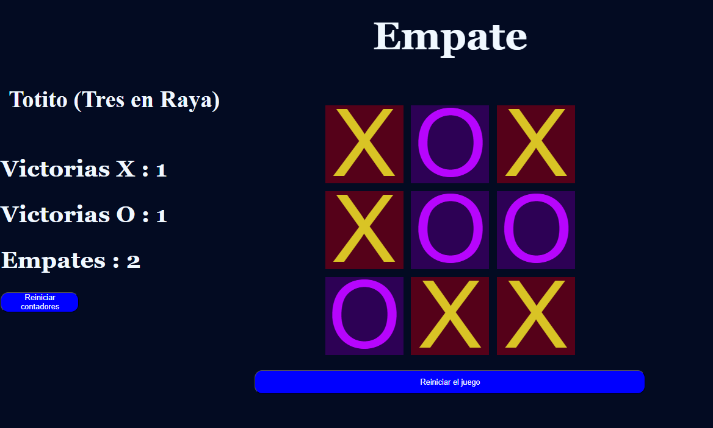

# Juego-Tres-en-Raya
ejercicio que consiste en crear  el juego Tres en Raya usando HTML, CSS y JavaScript, donde dos jugadores puedan turnarse y el sistema detecte automáticamente quién es el ganador.

